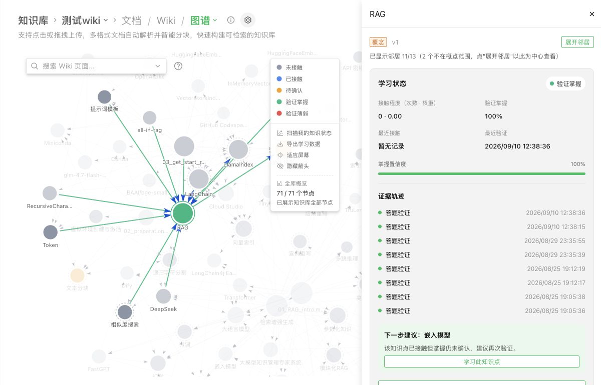
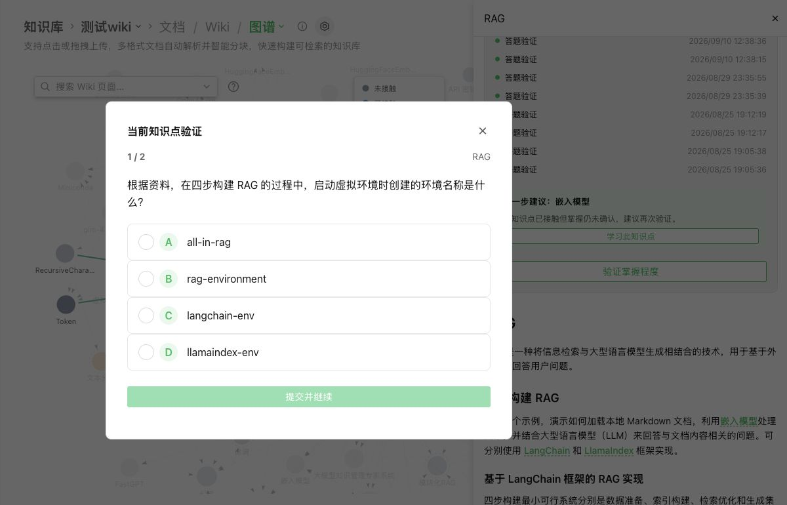

# WeKnora 知识网络与引导式学习

## 课题四 · Knowledge MRI 技术报告

作者：张凌浩（GitHub：zlh123123）
日期：2026-09-10
提交版本：rhino-2026-final-4
仓库：https://github.com/zlh123123/WeKnora

## 1. 问题与成果

知识库问答能够给出答案，却不直接告诉学习者哪些内容只是接触过、哪些已经通过验证。本项目基于 WeKnora 的 Wiki 知识网络，在公共 Concept 图上叠加按用户隔离的学习状态，并通过有来源的选择题形成“查看状态—验证—查看证据—阅读建议—再次验证”的轻量闭环。

实现重点是把引用展示与掌握证据分开。系统展示一段来源，只产生 Exposure；用户作答后，由服务端判分更新掌握状态。LLM 负责生成题目，不直接决定用户掌握程度。

已交付个人知识地图、证据时间线、六题快速扫描、当前知识点两题复测、规则推荐、画像导出/清除/停用，以及离线审核脚本和冻结结果。真实题库审核发现概念相关性、歧义和重复问题，因此本项目定位为可运行探索原型，不宣称已经证明教学效果。

## 2. 课题要求对应

| 要求 | 本次实现与证据 |
|---|---|
| 学习节点与状态设计 | Wiki Concept 稳定身份、Exposure 与 Quiz 证据分离 |
| 可运行交互原型 | 个人地图、扫描、定向复测、证据与推荐 |
| 一种有效性验证方法 | 30 条真实映射、24 道真实题的 AI 辅助审核；合成敏感性对照 |
| 多租户与个人画像管理 | 服务端 scope、查看/导出/清除/停用接口及隔离测试 |
| 技术材料与复现 | 本报告、冻结数据、评估脚本、运行说明、版本标签 |

长期 Memory 没有与学习画像合并；推荐不是先修关系推理。本次选择实现知识网络与验证闭环，不覆盖课题中的全部可探索方向。

## 3. 用户使用流程

用户导入资料并生成 Wiki 后，可以正常进行带知识库引用的问答。完成并持久化的 Assistant Message 中的有效引用被映射到 Concept，个人地图显示相应的接触状态。

在地图中，用户打开节点查看当前状态与证据；“快速知识扫描”选取三个知识点、每点两题。“当前知识点验证”只针对当前节点出两题，可中断恢复，与原有六题扫描独立。提交后服务端保存作答、判分并更新状态，完成时地图与证据抽屉刷新。

用户可以打开推荐的 Wiki 内容继续阅读，然后再次定向验证。推荐为空时不会编造学习路径。导出、清除与停用为用户提供个人画像控制。演示步骤与首次运行说明见 run_and_demo.md。

## 4. 架构与数据流

整体数据流分两条：

```text
文档 -> Chunk -> Wiki Concept / Graph
最终回答引用 -> 引用校验与 Concept 映射 -> Exposure Evidence
Concept 的有效 Chunk -> LLM 出题 -> JSON 与来源校验 -> QuizItem
用户作答 -> 服务端判分 -> Attempt + Evidence + State 事务
State + 公共 Graph -> 个人地图 / 证据抽屉 / 规则推荐
```

个人画像范围固定为 tenant_id + subject_id + knowledge_base_id。subject_id 从已登录 Web principal 的 StorageID 推导，不接受客户端指定他人身份。公共 Wiki 页面和题库按租户/知识库共享；个人状态、证据、作答和扫描按用户隔离。Learning 独立于 MemoryItem。

| 数据表 | 责任 |
|---|---|
| learning_profiles | 当前 scope 的追踪开关及清除时间 |
| learning_concept_identities | Wiki 页面与稳定 concept_key 对应 |
| learning_evidence | 引用展示及答题证据 |
| user_concept_states | 当前 Exposure、Mastery、Confidence 投影 |
| quiz_items | Concept、题目、来源、source_hash、prompt_version |
| quiz_attempts | 作答、判分、扫描与幂等记录 |
| learning_scans | 六题扫描或两题复测的进度与恢复 |

证据在常规写入中追加，用户清除时允许删除，不应把 append-only 理解为永不删除个人数据。

## 5. 关键规则与取舍

### 5.1 引用展示不代表掌握

系统只使用最终 Assistant Message 的 KnowledgeReferences，并校验知识库及 Chunk。一个 Chunk 关联 N 个 Concept 时，每个 Concept 分配 1/N 的 Exposure confidence。原始检索候选、打开 Wiki 页面或点击引用都不自动变成掌握证据。该信号不能证明用户实际阅读。

### 5.2 出题与判分

从已发布 Concept 的有效文本 Chunk 生成四选一题；服务端校验 JSON、四个不同选项、0–3 范围内的答案索引、解释、来源属于输入集合和题目文本重复。记录 source_hash 以判断来源变化。前端做题 DTO 不预先返回正确答案。

这些结构校验不能保证语义上只有一个正确选项，也不能保证题目有效测量所属 Concept。真实审核中的问题验证了这一限制。产品的题目重复检查也不能替代全库语义去重。

### 5.3 掌握状态

聚合当前 source hash、非 stale 题目的最近四次有效作答。少于两次为 uncertain；正确率 >= 0.80 为 verified_strong，<= 0.40 为 verified_weak，其他为 uncertain。mastery_confidence 为有效作答数除以四，最多为一，是证据量指标，不是统计概率。

两题全部答对即可达到 strong，因此 UI 中的“验证掌握”应理解为通过当前有限验证，不能等同全面掌握。题库复用可能产生记忆答案效应；没有时间衰减、题目难度校准或完整知识追踪模型。

### 5.4 扫描、身份与推荐

全库扫描优先已有状态的 Concept，再依据 0.50 × (1-confidence) + 0.35 × 归一化 Exposure 权重 + 0.15 × 归一化图度排序。不是只优先薄弱节点；已有 strong 状态也属于已见候选。六题扫描与各节点两题扫描独立恢复，通过已保存题目归属识别目标。

本次修复了部分 identity 已存在时遗漏其余节点的问题：打开个人地图或创建扫描时补齐所有缺失的已发布 Concept，并保留已有 key 与状态。另一个仍存在的同名/别名页面不能抢占旧 key。失去页面对应关系的身份标为 orphaned。

扫描创建使用有界进程内互斥锁，解决同进程重入；它不是分布式锁。展示扫描改为按 ID 批量取题，避免逐 Concept 扫描题库。复测结束同步刷新地图与抽屉。

推荐排除当前节点和 strong 节点，按 weak、uncertain、exposed，再按接触次数和稳定 key 排序，最多给一个巩固建议。该规则易解释，但没有构造先修知识路径或验证推荐学习收益。

## 6. 隐私与生命周期

学习接口经过已登录身份、知识库访问和 scope 校验。导出仅含当前 scope 的个人状态、证据、作答，以及当前 KB 的安全题目视图，不附题库正确答案和解释。最终新增测试验证三个隔离维度及答案字段不泄露。

个人地图现提供停用、清除按钮及确认说明，无需手工调用接口。清除删除当前用户范围内状态、证据、作答与扫描，并记录 cleared_at 防止迟到事件恢复旧数据；不会删除其他人的记录或公共题库。停用后拒绝新增追踪和答题写入。KB/租户删除入口包含学习表清理，但生产 PostgreSQL 的全部删除、权限撤销及并发场景未做完整端到端验收。

离线审核材料仅导出公开教材片段和生成题，不包含用户画像、账户、聊天或模型密钥。其题目答案为评审复核用途，与产品答题接口分离。语料署名与许可证见 evaluation/README.md。

## 7. 工程验证

功能修改完成后已通过全仓 Go 测试、learning/repository race 测试、前端 441 项测试、类型检查和构建。最终增加导出隔离测试后，又通过 learning、repository、handler、router 四包。补齐停用/清除界面后，前端 441 项、类型检查和构建再次通过。前端部分测试属于源码约束检查，不能替代浏览器验收。

2026-09-10，本机 Docker + PostgreSQL + Edge 在“测试wiki”完成真实定向复测：题量 1/2，提交后 2/2，关闭恢复第二题，完成后 strong 1。数据库保存 completed/current_index=2/total_items=2，抽屉出现两条新证据；原六题扫描仍为 pending/current_index=0/total_items=6。该操作用于功能验收，答案由验收过程选择，不构成学习效果样本。

详细记录见 retest_checkpoint_2026-09-10.md。全新机器安装、独立新用户完整旅程、所有模型失败恢复和多实例并发仍未完整验收，应与已验证路径区分。

## 8. 真实数据评估

冻结两个现有知识库：RAG 教材 3 文档产生 30 个 Concept、82 条引用；视觉教材 30 文档产生 97 个 Concept、1243 条引用。全部 1325 条引用都能解析到启用 Chunk，但可解析不等于语义支持。视觉语料含中英文及预处理版本，存在内容重叠。

每库固定种子抽取 15 个引用对，Codex 对照独立片段逐条审核，18 条明确支持、4 条不支持、8 条不确定，保守支持率为 60.0%。该样本为等额分层，不是全体引用的无偏质量估计。

对当前全部 24 道有效题作四维审核：来源支持 22/24、唯一答案 21/24、概念相关 21/24、无等价重复 22/24；四项同时通过 16/24（66.7%）。问题包括环境名记忆题、跨节点重复题、batch 限定遗漏及源码上下文缺失。

这是作者侧 AI 辅助审核，没有独立人工标签或试用用户。保留了所有失败项和逐条理由，未清理问题题后重新计算。题库仅六个 Concept；历史生成模型版本未落库，不能重建完全相同的出题过程。冻结数据可复算审核结果，但审核判断本身需要评审复核。

## 9. 合成对照与解释

补充 10000 个合成个体、种子 20260910 的敏感性实验。潜在正确率 p 在 [0,1] 均匀分布，作答独立服从 Bernoulli(p)，比较 Exposure 独立、正相关、负相关三种条件；观察 2/4/6 次作答的最近四次窗口。常数 0.5 的 Brier 为 0.2500。

| 条件 | Exposure Brier | 原始正确率 Brier | 正确率乘 confidence |
|---|---:|---:|---:|
| 独立 Exposure，2 次 | 0.3286 | 0.2512 | 0.2763 |
| 独立 Exposure，4 次 | 0.3286 | 0.2105 | 0.2105 |
| 正相关 Exposure，4 次 | 0.2001 | 0.2105 | 0.2105 |
| 负相关 Exposure，4 次 | 0.4965 | 0.2105 | 0.2105 |

验证规则并非在所有设定中优于 Exposure。两题时乘 confidence 甚至弱于常数基线，因此本报告不把该乘积视为校准后的成功概率。两题被判 strong 的合成个体中，50.2% 的 latent p 低于 0.8，说明轻量验证存在明显测量不确定性。Laplace 平滑对照表现更好，但尚未实现进产品，也不能由合成结果直接确定真实最优规则。

完整九组结果见 evaluation.md。旧版本仅使用独立 Exposure 的 500 样本结果保留作历史记录，不再单独用来支持有效性提升。

## 10. 结论与下一步

本项目完成了在 WeKnora 知识网络上建立可追溯个人学习状态、扫描和定向复测的可运行原型，并提供可复算的真实内容审核与合成对照。工程证据支持闭环能够执行和状态能够持久化；现有评估不支持真实学习效果提升、最优推荐或掌握度校准的主张。

后续优先级是：补足被切断的表格/代码上下文；增加题目相关性与语义去重审核；弱化两题 strong 的确定性表达，积累独立题目；再邀请独立使用者或开展更长的个人纵向记录。跨实例锁、来源失效恢复、权限撤销和规模性能属于部署深化工作。

## 11. 交付与复现索引

- 代码：GitHub zlh123123/WeKnora，标签 rhino-2026-final-4；完整 SHA 见标签及 submission.yaml。
- 技术说明：technical_report.md / technical_report.pdf。
- 运行与演示：run_and_demo.md；原创短材料 demo/rag_demo.md。
- 评估：evaluation.md、evaluation/ 下冻结来源、标签和数值。
- 脚本：scripts/knowledge_mri_audit.py、scripts/knowledge_mri_sensitivity.py。
- 验收：retest_checkpoint_2026-09-10.md、submission/validation.txt。

复算只需要 Python 3 标准库；交互原型还需要 Docker、可用模型和知识库资料。运行说明明确了源码构建方式和已验证环境。没有附带真实用户数据或服务密钥。

## 附录：真实界面



图 1：2026-09-10 重新打开本机页面，RAG 节点保留既有验证和证据时间线。公共图包含非 Concept 节点，因此图中总节点数不等于本报告的学习 Concept 数。



图 2：从当前节点进入两题复测，显示 1/2。此处环境名称题正是审核中的 Q04 失败案例；截图证明交互入口可用，不代表这道题通过质量审核。本轮仅打开，未提交新答案。

## 附录：界面证据补充

主报告嵌入的图 1 和图 2 是 2026-09-10 重新验收时保存的 1200×770 高清截图，分别展示个人地图/证据抽屉和两题定向复测。

此前阶段验收的 4 张 765×771 截图保留在仓库 [screenshots/](screenshots/) 目录，作为历史参考，不再嵌入 PDF，以免缩放后影响阅读：

- [知识图谱 / 我的知识地图切换](screenshots/phase5_breadcrumb_mode_dropdown.png)
- [普通知识图谱](screenshots/phase5_ordinary_graph.png)
- [个人知识地图](screenshots/phase5_personal_map.png)
- [节点学习抽屉](screenshots/phase5_learning_drawer.png)

快速扫描 `1 / 6`、导出、停用和清除确认框的操作步骤见 [run_and_demo.md](run_and_demo.md)。浏览器控制恢复后，下一次验收应优先补拍这三类高清动态状态。
